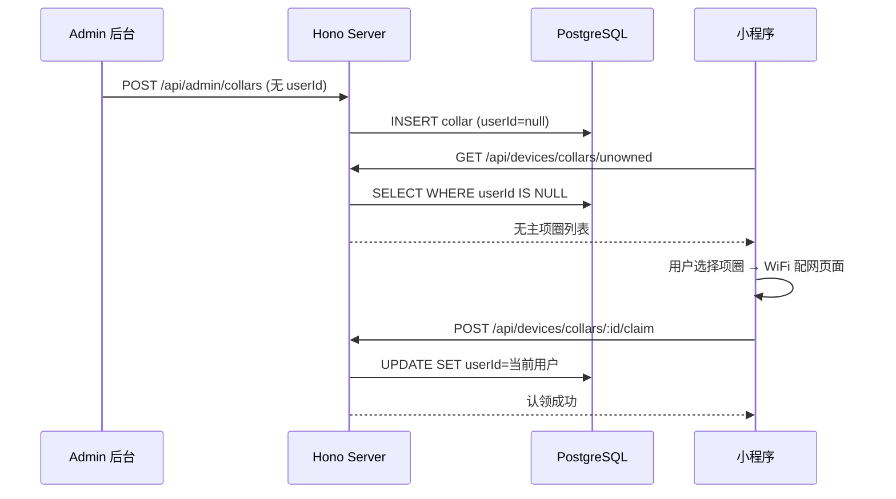

# 技术设计：模拟设备绑定流程

## 架构概览

## 改动清单

### 1. DB Schema (`packages/server/src/db/schema.ts`)

- `collarDevices.userId`: `.notNull()` → 可选（去掉 notNull）
- `desktopDevices.userId`: `.notNull()` → 可选（去掉 notNull）
- 生成并执行 migration

### 2. Server API (`packages/server/src/routes/devices.ts`)

新增端点：
- `GET /devices/collars/unowned` — 返回所有 userId 为 null 的项圈
- `GET /devices/desktops/unowned` — 返回所有 userId 为 null 的桌面摆台
- `POST /devices/collars/:id/claim` — 认领无主项圈（设置 userId + name）
- `POST /devices/desktops/:id/claim` — 认领无主桌面摆台（设置 userId + name）

### 3. Server Admin (`packages/server/src/routes/admin.ts`)

- POST /collars 和 POST /desktops 的 userId 改为可选

### 4. Admin 前端 (`packages/admin/src/pages/`)

- `Collars.tsx`: userId 表单改为非必填；列表中 userId 为空显示 "无主" Tag
- `Desktops.tsx`: 同上

### 5. 小程序前端

- `collar-bind/index.tsx`:
  - handleSearch 改为调 `GET /api/devices/collars/unowned`
  - 显示无主设备列表（每个带红色 Mock 标识）
  - 用户选择后进入 wifi-config 页面，传递 collarId

- `wifi-config/index.tsx`:
  - 如果带 collarId 参数，配网成功后调 `POST /api/devices/collars/:id/claim`（认领）
  - 不再 POST 创建新设备

- `desktop-bind/index.tsx`:
  - 改为与 collar-bind 同样的搜索+选择模式
  - 调 `GET /api/devices/desktops/unowned` 获取无主摆台
  - 选择后走配网，配网成功后调 `POST /api/devices/desktops/:id/claim`
  - 认领成功后跳转到 desktop-pair 页面选择宠物

### 6. Shared Types (`packages/shared/src/types.ts`)

- `CollarDevice.userId` 和 `DesktopDevice.userId` 改为 `string | null`

## 安全考虑

- unowned 端点仍需 JWT 认证（防止未登录用户扫描设备）
- claim 端点需校验设备确实无主（userId === null），防止抢占已绑定设备
