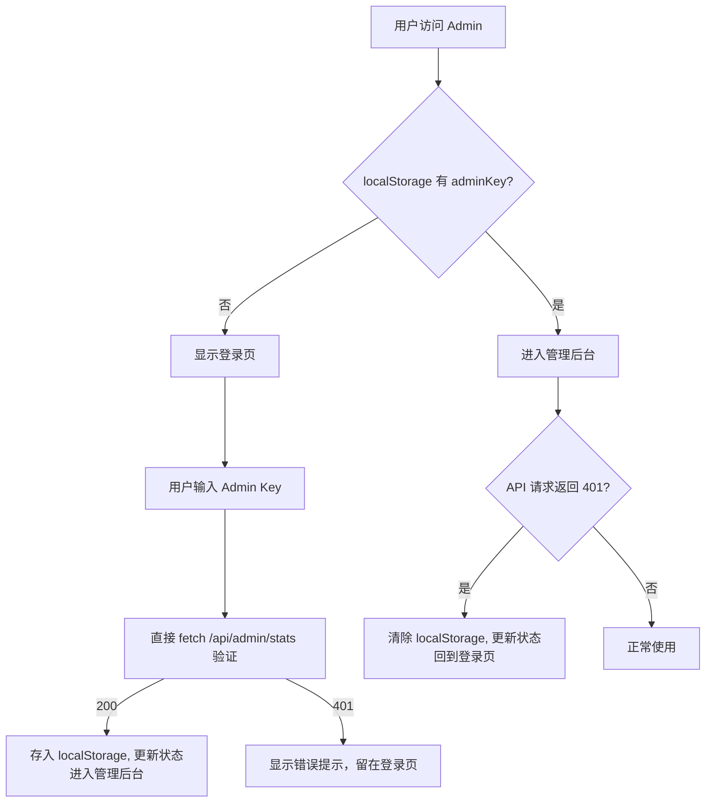

# 技术设计：Admin 管理端登录认证

## 架构概览

纯前端改动为主，后端无需修改（已有 401 校验逻辑）。核心是移除前端硬编码默认值，新增登录门禁。



## 需要修改的文件

| 文件 | 改动 |
|------|------|
| `packages/admin/src/api/client.ts` | 移除 `getAdminKey()` 的 fallback 默认值；新增独立的 `verifyAdminKey(key)` 函数；`request()` 函数增加 401 响应处理 |
| `packages/admin/src/App.tsx` | 增加登录门禁逻辑；增加退出登录按钮；保留现有 Admin Key 设置按钮 |

## 详细设计

### 1. `client.ts` 改动

**移除 fallback：**
```typescript
export function getAdminKey() {
  return localStorage.getItem("adminKey") || "";
}
```

**新增独立验证函数（不走全局 request）：**
```typescript
// 登录页专用：直接用传入的 key 发请求，不依赖 localStorage
export async function verifyAdminKey(key: string): Promise<boolean> {
  const res = await fetch("/api/admin/stats", {
    headers: {
      "Content-Type": "application/json",
      "X-Admin-Key": key,
    },
  });
  return res.ok;
}
```

> 关于用 `/api/admin/stats` 作为验证探针：MVP 阶段可接受，该接口足够轻量（只是 count 查询）。如果后续 stats 接口变重或权限分级，再抽出专用的 `/api/admin/ping` 端点。

**全局 request 增加 401 处理（仅在已登录态生效）：**
```typescript
if (res.status === 401) {
  localStorage.removeItem("adminKey");
  // 使用 reload 而非硬编码路径，兼容未来子路径部署
  window.location.reload();
  // 抛出错误但因为 reload 了，不会导致未捕获异常
  throw new Error("Admin Key 无效");
}
```

> 注意：登录页使用 `verifyAdminKey()` 而非 `request()`，所以登录失败时不会触发全局 401 跳转，满足"登录失败只报错不跳转"的需求。

### 2. `App.tsx` 改动

**状态管理：**
```typescript
const [isAuthed, setIsAuthed] = useState(() => !!getAdminKey());
```

**条件渲染：**
- `isAuthed === false` → 渲染登录表单
- `isAuthed === true` → 渲染现有管理后台布局

**登录表单（内联在 App.tsx，不新建文件）：**
```tsx
<Layout style={{ minHeight: "100vh", display: "flex", alignItems: "center", justifyContent: "center" }}>
  <Card title="YEHEY 管理后台" style={{ width: 400 }}>
    <Input.Password placeholder="请输入 Admin Key" value={keyInput} onChange={...} />
    {error && <Alert type="error" message={error} />}
    <Button type="primary" block loading={loading} onClick={handleLogin}>
      登录
    </Button>
  </Card>
</Layout>
```

**登录处理：**
```typescript
const handleLogin = async () => {
  setLoading(true);
  setError("");
  const ok = await verifyAdminKey(keyInput);
  if (ok) {
    setAdminKey(keyInput);
    setIsAuthed(true);
  } else {
    setError("Admin Key 无效，请重新输入");
  }
  setLoading(false);
};
```

**Header 按钮：**
- 保留现有"Admin Key"设置按钮（`SettingOutlined`）
- 新增"退出登录"按钮（`LogoutOutlined`），点击后：
  ```typescript
  localStorage.removeItem("adminKey");
  setIsAuthed(false);
  ```

### 3. 多标签页同步（storage 事件）

监听 `storage` 事件，当其他标签页修改/删除了 `adminKey` 时同步状态：
```typescript
useEffect(() => {
  const handler = (e: StorageEvent) => {
    if (e.key === "adminKey") {
      setIsAuthed(!!e.newValue);
    }
  };
  window.addEventListener("storage", handler);
  return () => window.removeEventListener("storage", handler);
}, []);
```

## 后端

无需改动。现有 `adminMiddleware` 已正确处理空/错误 key → 返回 401。

## 安全考虑

- Admin Key 存储在 localStorage 中（与当前行为一致），足够 MVP 使用
- 移除前端硬编码默认值是此次改动的核心安全提升
- 后端 `ADMIN_KEY` 环境变量的默认值 `"yehey-admin-dev"` 保持不变（部署时通过环境变量覆盖）

## 测试策略

- 清除 localStorage 后访问 admin → 应看到登录页
- 输入错误 key → 应显示错误提示，停留在登录页
- 输入正确 key → 应进入管理后台
- 已登录状态下 API 返回 401（key 被后端修改）→ 应自动回到登录页
- 已登录状态下点击退出 → 应回到登录页
- 在 `/events` 页面时退出登录 → reload 后应看到登录页（不跳到错误路径）
- 多标签页：一个标签退出，另一个标签应同步退出
- 网络错误/5xx → 不应触发登录页跳转，只显示常规错误
