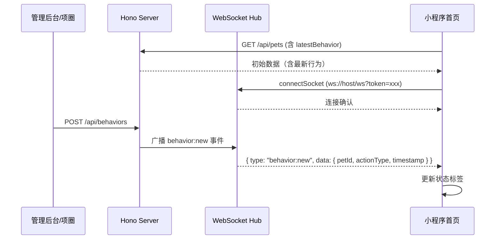

# 技术设计：宠物状态文字展示（WebSocket 实时推送）

## 架构概览



## 修改文件清单

| 文件 | 改动 |
|------|------|
| `packages/shared/src/types.ts` | Pet 增加 `latestBehavior` 字段；新增 WS 消息类型 |
| `packages/server/src/index.ts` | 注册 Bun WebSocket handler |
| `packages/server/src/ws.ts` | **新建** — WebSocket 连接管理和广播 |
| `packages/server/src/routes/pets.ts` | GET 接口附带 latestBehavior |
| `packages/server/src/routes/behaviors.ts` | POST 后广播 WS 事件 |
| `packages/app/src/utils/ws.ts` | **新建** — 小程序 WebSocket 客户端（连接/心跳/重连/事件分发） |
| `packages/app/src/pages/index/index.tsx` | 渲染状态标签 + 订阅 WS 事件 |
| `packages/app/src/pages/index/index.scss` | 状态标签样式 |

## 详细设计

### 1. 共享类型 (`packages/shared/src/types.ts`)

```typescript
// Pet 接口增加
export interface Pet {
  // ... 现有字段
  latestBehavior: { actionType: string; timestamp: string } | null;
}

// WebSocket 消息类型
export interface WsMessage {
  type: "behavior:new" | "ping" | "pong";
  data?: any;
}
```

### 2. 服务端 WebSocket Hub (`packages/server/src/ws.ts`)

使用 Bun 原生 WebSocket 支持（零依赖）：

- **连接管理**：`Map<userId, Set<WebSocket>>` 存储活跃连接
- **鉴权**：连接时从 URL query 参数取 token，复用现有 `verifyToken` 验证
- **广播**：`broadcast(userId, message)` 向指定用户的所有连接推送
- **心跳**：客户端每 30s 发 ping，服务端回 pong；超时 60s 无心跳断开

### 3. 服务端入口变更 (`packages/server/src/index.ts`)

Bun 的 `export default` 支持同时定义 `fetch` 和 `websocket` handler：

```typescript
export default {
  port,
  fetch(req, server) {
    // WebSocket 升级请求
    if (new URL(req.url).pathname === "/ws") {
      server.upgrade(req);
      return;
    }
    return app.fetch(req, server);
  },
  websocket: wsHandler,
};
```

### 4. 后端 API 变更

**GET `/api/pets`**：用 `DISTINCT ON` 批量查每只宠物最新行为，应用层合并。

**GET `/api/pets/:id`**：同理查最新行为。

**POST `/api/behaviors`**：插入后调用 `broadcast(pet.userId, { type: "behavior:new", data })` 推送。

### 5. 小程序 WebSocket 客户端 (`packages/app/src/utils/ws.ts`)

使用 `Taro.connectSocket` API：

- **连接**：`ws://BASE_URL/ws?token=xxx`（去掉 http:// 前缀）
- **心跳**：每 30s 发 `{ type: "ping" }`
- **重连**：断开后指数退避重连（1s, 2s, 4s, max 30s）
- **事件订阅**：简单的 pub/sub 模式，`subscribe(type, callback)` / `unsubscribe`
- **生命周期**：App 级别连接（登录后连接，退出时断开）

### 6. 首页 UI

**状态标签位置**：`hero-caption` 下方，新增 `.pet-status-tag`。

**展示**：
- 有行为：「{相对时间} · {actionType}」
- 无行为：「暂无活动记录」

**相对时间**：< 1min → "刚刚"，< 60min → "X分钟前"，< 24h → "X小时前"，< 7d → "X天前"，≥ 7d → "X周前"

**实时更新**：订阅 `behavior:new`，匹配 petId 后更新对应宠物的 latestBehavior state。

## 测试策略

- 后端：用 wscat 或管理后台触发行为，观察 WS 推送
- 前端：小程序模拟器中验证状态标签初始加载和实时更新

## 安全考虑

- WS 连接通过 token 鉴权，复用 JWT 验证
- 广播按 userId 隔离，用户只能收到自己宠物的事件
