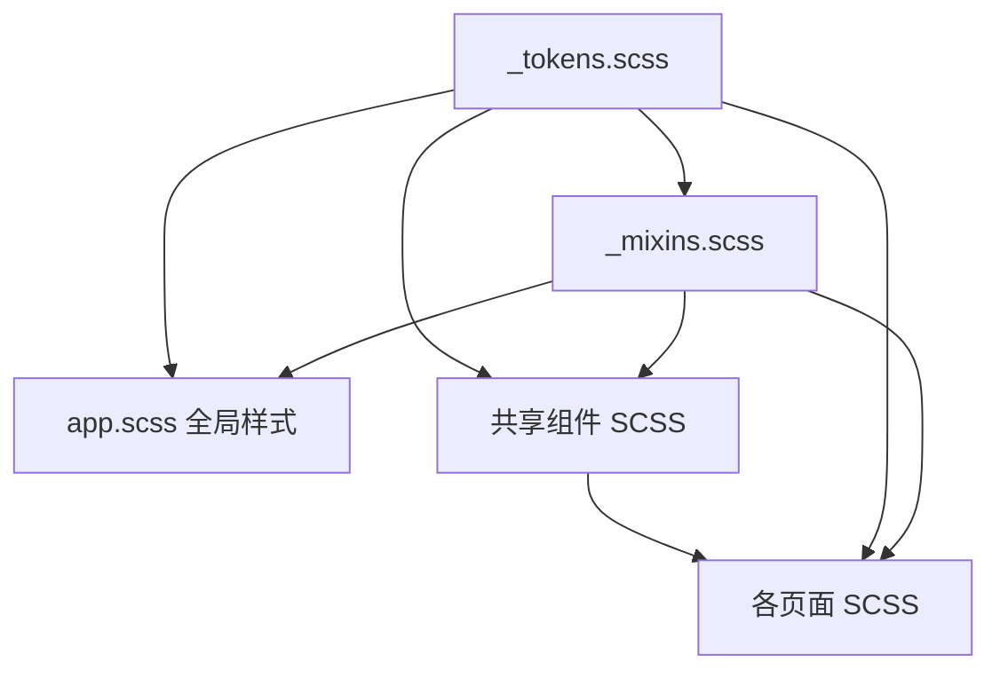

# 技术设计：全面 UI 审查与优化

## 架构概览

采用 **Design Tokens → Global Styles → Shared Components → Pages** 的分层架构：



核心思路：从底层 token 开始建设，逐层向上统一，最终各页面引用 token 和 mixin，消除硬编码值。

**重要：Sass 导入机制**
- `app.scss` 的变量**不会**自动传递给页面 SCSS
- 每个页面 SCSS 必须显式 `@import` token 文件
- 鉴于 `@tarojs/plugin-sass@2.2.22` 与 Taro 4.1.11 的兼容性风险，统一使用 `@import` 而非 `@use/@forward`
- 通过 Taro Sass 插件的 `resource` 配置实现全局自动注入 token（避免每个文件手动 import）

## 文件结构

### 新增文件

```
packages/app/src/
├── styles/
│   ├── _tokens.scss        # Design tokens（颜色、字号、间距、圆角、阴影）
│   └── _mixins.scss         # 工具 mixin（安全区、按钮变体、卡片等）
├── components/
│   ├── NavBar/              # 已有，需增强（支持 tab 页、左右内容区）
│   ├── StepIndicator/       # 新增：步骤指示器
│   └── MockBadge/           # 新增：Mock 模式标识
└── hooks/
    └── useSafeArea.ts       # 新增：安全区 hook（含平台兼容处理）
```

> **决策：不提取 DeviceCard 和 PetSelector 为共享组件**
>
> Codex 审查发现：
> - DeviceCard 在不同页面有 3 种变体（devices 页的完整卡片含 share/mac/编辑、首页的摘要态、desktop-bind 的选中态），强行统一会变成条件分支地狱
> - PetSelector 有 3 种交互模型（devices 循环切换、pet-info 箭头切换、desktop-pair 列表选择），抽象成本高于复用收益
>
> 替代方案：通过统一的 token 和 mixin 保证视觉一致性，各页面保留自己的组件实现

### 需修改文件

| 文件 | 修改内容 |
|------|----------|
| `config/index.ts` | 配置 Sass resource 全局注入 tokens |
| `app.scss` | 用 token 变量替换硬编码值 |
| `components/NavBar/index.tsx` | 增加 leftContent/rightContent slot、tab 页模式 |
| `components/NavBar/index.scss` | 使用 tokens 替换硬编码色值 |
| 所有 17 个页面的 `index.scss` | 替换硬编码值为 token 变量 |
| 所有 17 个页面的 `index.tsx` | 使用 NavBar 替换自建导航栏，使用 useSafeArea hook |

## 详细设计

### 1. Sass 全局注入配置

在 Taro 配置中通过 `sass.resource` 自动注入 token，避免每个文件手动 import：

```typescript
// config/index.ts
sass: {
  resource: [
    'src/styles/_tokens.scss',
    'src/styles/_mixins.scss',
  ]
}
```

### 2. Design Tokens（`_tokens.scss`）

基于现有代码中出现的值，整理为系统化 token：

```scss
// ===== 颜色 =====
$color-primary: #2B2520;          // 主色（深棕）
$color-primary-light: #3D352E;    // 主色浅
$color-bg: #FAF8F5;               // 页面背景
$color-bg-card: #fff;             // 卡片背景
$color-bg-input: #F3EDE6;         // 输入框背景
$color-bg-section: #F5F0EB;       // 区块背景

$color-text-primary: #2B2520;     // 主文字
$color-text-secondary: #8B847A;   // 次要文字
$color-text-tertiary: #B5AFA6;    // 辅助文字
$color-text-placeholder: #C5BFB6; // 占位符文字
$color-text-inverse: #fff;        // 反色文字

$color-border: #E8E2DA;           // 通用边框
$color-border-light: #E0D9CF;     // 浅边框
$color-divider: #F0EBE4;          // 分割线

$color-accent: #E8A849;           // 强调色（金色）
$color-accent-dark: #D4922E;      // 强调色深
$color-success: #7BA884;          // 成功/在线
$color-error: #D4553A;            // 错误/离线
$color-warning: #F2C94C;          // 警告/中等
$color-info: #5B9BD5;             // 信息

// 状态色
$color-status-online: $color-success;
$color-status-offline: #C5BFB6;
$color-status-pairing: $color-accent;

// Mock 模式
$color-mock-bg: #FDF2F0;
$color-mock-text: $color-error;

// ===== 字体大小（6 级层次）=====
$font-size-xs: 20px;              // 极小（徽章、角标）
$font-size-sm: 24px;              // 小（辅助信息、标签）
$font-size-base: 28px;            // 基准（正文）
$font-size-md: 32px;              // 中（副标题、NavBar 标题）
$font-size-lg: 36px;              // 大（页面标题）
$font-size-xl: 48px;              // 特大（品牌、数字强调）

// ===== 字重 =====
$font-weight-normal: 400;
$font-weight-medium: 500;
$font-weight-semibold: 600;
$font-weight-bold: 700;

// ===== 间距（8px 基准）=====
$spacing-xs: 8px;
$spacing-sm: 12px;
$spacing-md: 16px;
$spacing-lg: 24px;
$spacing-xl: 32px;
$spacing-2xl: 48px;

// ===== 圆角 =====
$radius-sm: 8px;                  // 小元素（徽章、标签）
$radius-md: 16px;                 // 中等（输入框、小卡片）
$radius-lg: 28px;                 // 大（卡片）
$radius-xl: 48px;                 // 圆形按钮
$radius-full: 50%;                // 完全圆形（头像）

// ===== 阴影 =====
$shadow-card: 0 4px 20px rgba(43, 37, 32, 0.04);
$shadow-button: 0 8px 24px rgba(43, 37, 32, 0.2);
$shadow-float: 0 8px 32px rgba(43, 37, 32, 0.12);

// ===== 尺寸 =====
$btn-height: 88px;
$input-height: 88px;
$nav-back-size: 64px;
$container-padding: $spacing-xl;  // 32px
```

### 3. Mixins（`_mixins.scss`）

```scss
// 安全区底部 padding（兼容旧版 iOS constant() 和新版 env()）
@mixin safe-area-bottom($extra: 0px) {
  padding-bottom: calc(constant(safe-area-inset-bottom) + #{$extra});
  padding-bottom: calc(env(safe-area-inset-bottom) + #{$extra});
}

// 安全区顶部 padding
@mixin safe-area-top($extra: 0px) {
  padding-top: calc(constant(safe-area-inset-top) + #{$extra});
  padding-top: calc(env(safe-area-inset-top) + #{$extra});
}

// 按钮基础
@mixin btn-base {
  border-radius: $radius-xl;
  height: $btn-height;
  line-height: $btn-height;
  text-align: center;
  font-size: 30px;
  font-weight: $font-weight-medium;
  letter-spacing: 1px;
  &:active { opacity: 0.7; }
}

// 按钮主样式
@mixin btn-primary {
  @include btn-base;
  background: linear-gradient(135deg, $color-primary, $color-primary-light);
  color: $color-text-inverse;
  box-shadow: $shadow-button;
}

// 按钮次样式
@mixin btn-secondary {
  @include btn-base;
  background-color: $color-bg-card;
  color: $color-text-primary;
  border: 2px solid $color-border;
}

// 卡片基础
@mixin card-base {
  background: $color-bg-card;
  border-radius: $radius-lg;
  padding: $spacing-xl;
  box-shadow: $shadow-card;
}

// 文字截断
@mixin text-ellipsis($lines: 1) {
  @if $lines == 1 {
    overflow: hidden;
    text-overflow: ellipsis;
    white-space: nowrap;
  } @else {
    display: -webkit-box;
    -webkit-line-clamp: $lines;
    -webkit-box-orient: vertical;
    overflow: hidden;
  }
}

// Mock 标识
@mixin mock-badge {
  background: $color-mock-bg;
  color: $color-mock-text;
  font-size: $font-size-xs;
  padding: 4px $spacing-sm;
  border-radius: $radius-sm;
  font-weight: $font-weight-medium;
}

// 微信原生按钮样式重置（用于覆盖微信 Button 默认样式）
@mixin wx-button-reset {
  &::after { border: none; }
  background: none;
  border: none;
  padding: 0;
  margin: 0;
  line-height: inherit;
  font-size: inherit;
}
```

### 4. 安全区 Hook（`useSafeArea.ts`）

```typescript
import { useMemo } from "react";
import Taro from "@tarojs/taro";

export function useSafeArea() {
  return useMemo(() => {
    const systemInfo = Taro.getSystemInfoSync();
    const statusBarHeight = systemInfo.statusBarHeight ?? 20;
    const safeArea = systemInfo.safeArea;
    const bottomSafeArea = safeArea
      ? systemInfo.screenHeight - safeArea.bottom
      : 0;

    // getMenuButtonBoundingClientRect 仅微信小程序可用
    let navHeight = 44; // 默认值
    try {
      const menuButton = Taro.getMenuButtonBoundingClientRect();
      if (menuButton && menuButton.top > 0) {
        navHeight = (menuButton.top - statusBarHeight) * 2 + menuButton.height;
      }
    } catch {
      // 非微信平台 fallback
    }

    return { statusBarHeight, navHeight, bottomSafeArea };
  }, []);
}
```

### 5. NavBar 增强

扩展 NavBar 支持 tab 页（无返回按钮）、左右内容区：

```typescript
interface NavBarProps {
  title?: string;
  showBack?: boolean;
  onBack?: () => void;
  leftContent?: React.ReactNode;   // 自定义左侧内容（替代返回按钮）
  rightContent?: React.ReactNode;  // 自定义右侧内容
  transparent?: boolean;           // 透明背景模式
}
```

**关键设计决策：**
- tab 页面（devices/messages/profile/settings）使用 `showBack={false}` + `leftContent` 或 `title`
- `leftContent` 和 `showBack` 互斥：有 `leftContent` 时不显示返回按钮
- 标题居中，左右内容区绝对定位，避免重叠（标题使用 `max-width` 限制，左右各预留 100px）
- `rightContent` 支持 messages 页的"全部已读"按钮等用例

### 6. 共享组件设计

#### StepIndicator

用于 collar-bind、wifi-config 等流程页面的步骤指示器（两个页面样式完全一致）。

```typescript
interface StepIndicatorProps {
  steps: string[];
  current: number;  // 0-based
}
```

#### MockBadge

统一的 Mock 模式标识（当前 3 个页面有 3 种不同样式）。

```typescript
interface MockBadgeProps {
  text?: string;  // 默认 "模拟模式"
}
```

### 7. `!important` 处理策略

**不能一刀切删除所有 `!important`。** 微信小程序的 `<Button>` 组件自带默认样式（边框、padding、背景等），部分 `!important` 是必要的覆盖。

处理规则：
- **保留**：覆盖微信原生组件（Button/Input/Textarea）默认样式的 `!important`，改用 `wx-button-reset` mixin 统一管理
- **移除**：覆盖自定义样式的 `!important`，通过提高选择器优先级或重构样式层级解决

### 8. 页面改造策略

按依赖关系分 3 批次执行：

**批次 1：基础设施**
- 创建 `styles/_tokens.scss`、`styles/_mixins.scss`
- 配置 Taro sass.resource 全局注入
- 创建 `hooks/useSafeArea.ts`
- 改造 `app.scss` 使用 tokens
- 增强 NavBar 组件

**批次 2：共享组件**
- 创建 StepIndicator、MockBadge
- 各组件 SCSS 使用 tokens

**批次 3：页面改造（17 个页面）**

每个页面的改造步骤：
1. SCSS：替换所有硬编码颜色/字号/间距/圆角为 token 变量
2. TSX：替换自定义导航栏为 NavBar，使用 useSafeArea hook
3. TSX：替换重复 UI 为共享组件（StepIndicator/MockBadge）
4. SCSS：添加 `:active` 交互反馈
5. SCSS：底部操作区添加 `safe-area-bottom` mixin
6. SCSS：`!important` 按策略处理（保留微信原生覆盖，移除其余）

## 安全考虑

- 不涉及后端 API 或数据变更，纯前端样式重构
- 不修改业务逻辑，仅修改样式和组件结构
- 不影响 `components/ui` 目录（shadcn/ui 库代码）

## 测试策略

- **构建验证**：`pnpm dev:app` 确保编译通过
- **TypeScript 类型检查**：确保无类型错误
- **视觉验证（微信开发者工具）**：
  - 逐页面检查各页面渲染正确
  - iPhone 模拟器验证安全区（顶部 + 底部）
  - 验证 tab 页导航正常（无返回按钮、切换不闪屏）
- **交互验证**：
  - `openType="share"` 按钮功能正常
  - 按钮点击态反馈生效
  - 表单输入焦点和校验正常
- **端到端手动测试**（由用户执行）：
  - 真机（iPhone + Android）预览验证安全区
  - 完整业务流程走通（登录→引导→绑定→主页）

## 风险与缓解

| 风险 | 影响 | 缓解措施 |
|------|------|----------|
| Taro sass.resource 配置不生效 | Token 无法注入 | 回退到每个 SCSS 文件手动 `@import` |
| NavBar 替换破坏 tab 页布局 | 页面错位 | 逐页替换并在模拟器验证 |
| `!important` 移除导致微信按钮样式回退 | 按钮变形 | 使用 `wx-button-reset` mixin 替代 |
| Token 值近似但不完全匹配现有值 | 微小视觉变化 | Token 值精确匹配现有代码中最常用的值 |
| `constant()` 在新设备上被忽略 | 无影响 | CSS 会使用后定义的 `env()` 声明覆盖 |
