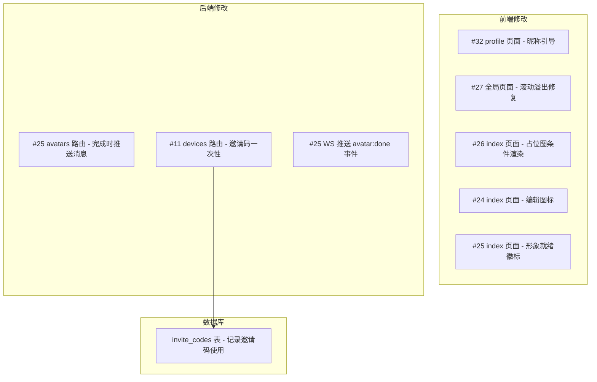

# 技术设计：修复所有 Open Issues

## 架构概览

6 个 issue 涉及前端 4 个页面 + 后端 3 个路由的修改，均为独立修复，无相互依赖。



## 各 Issue 技术方案

### #32 用户昵称默认为微信用户且无法修改

**现状分析：**
- `profile/index.tsx` 已有 `handleEditNickname` 实现，使用 `Taro.showModal({ editable: true })` 弹出编辑框
- 后端 `me.ts` PUT 接口已支持 nickname 更新
- 问题：昵称入口不够明显（只有账户信息区的「编辑资料」按钮），且默认昵称时没有引导

**方案：**
1. 在 `profile/index.tsx` 的用户昵称区域增加点击事件，让昵称本身可点击编辑
2. 使用函数判断是否为默认昵称：匹配 `微信用户`、`(微信用户)`、空串、纯空白、以 `用户` 开头的 4 位数后缀（手机登录默认）
3. 默认昵称时显示提示文字「点击修改昵称」，加可视化提示（如下划线 + 编辑图标）
4. 无需修改后端，已有接口

**修改文件：**
- `packages/app/src/pages/profile/index.tsx`
- `packages/app/src/pages/profile/index.scss`

---

### #27 多个页面滚动溢出安全区

**现状分析：**
- 消息页使用 `min-height: 100vh` + flex 布局，nav-bar 不固定
- 我的页同样 nav-bar 随内容滚动
- 小程序页面级滚动由 Taro 框架 + 微信控制，不同于 Web

**方案：**
采用「页面级固定头 + 内容区 ScrollView」模式：
1. **消息页**：页面根节点设 `height: 100vh; overflow: hidden`，nav-bar + tab-bar 保持普通流，消息列表用 `ScrollView scrollY` 填充剩余空间（已有 ScrollView）
2. **我的页**：同样根节点 `height: 100vh; overflow: hidden`，内容区包裹在 `ScrollView scrollY` 中（新增），nav-bar 保持普通流不随滚动
3. **设备页**：已有 ScrollView 结构，只需确认 nav-bar 不在 ScrollView 内（当前已正确）
4. **主页**：内容可能超出一屏（设备卡片在底部），改为 `height: 100vh; overflow: hidden` + 内容区 `ScrollView`

关键：使用 `height: 100vh` 而非 `min-height: 100vh`，配合 `overflow: hidden` 禁止页面级滚动，所有滚动由内部 `ScrollView` 承担。

**修改文件：**
- `packages/app/src/pages/messages/index.scss`
- `packages/app/src/pages/messages/index.tsx`
- `packages/app/src/pages/profile/index.scss`
- `packages/app/src/pages/profile/index.tsx`
- `packages/app/src/pages/index/index.scss`
- `packages/app/src/pages/index/index.tsx`

---

### #26 主页底部多余猫咪占位图

**现状分析：**
- `index/index.tsx` hero-image 始终渲染 `petHero`（静态占位图）
- 成品头像不在 `pet_avatars` 表，而在 `pet_avatar_actions` 表的 `image_url` 字段
- `pet_avatars` 表只有 `source_image_url`（原图）和 `status`
- 没有 `completed_at` 字段，需要用 `status='done'` + `created_at DESC` 来确定最新完成的定制

**方案：**
1. 后端 `pets.ts` GET 接口增加子查询：对每个 pet，找 `pet_avatars WHERE status='done' ORDER BY created_at DESC LIMIT 1`，再取其关联的 `pet_avatar_actions` 中 `sort_order=0` 的 `image_url` 作为主头像
2. 前端 `index.tsx` 条件渲染：`pet.avatarImageUrl` 存在时显示定制头像，否则显示 `petHero` 占位图
3. 在 shared types 中给 Pet 类型添加 `avatarImageUrl?: string` 可选字段

**修改文件：**
- `packages/server/src/routes/pets.ts`
- `packages/app/src/pages/index/index.tsx`
- `packages/shared/src/types.ts`

---

### #25 形象定制完成通知

**现状分析：**
- 定制完成时后端 `POST /:id/actions` 将状态设为 done，但没有任何通知
- 该接口当前使用 owner 鉴权，但注释写着「管理后台调用」—— 鉴权模型不一致
- WebSocket 已有事件推送机制

**方案：**
1. **后端通知逻辑**：在 `avatars.ts` 的 `POST /:id/actions` 中，当状态设为 done 时：
   - 先检查当前状态是否已为 done（幂等保护：若已 done 则跳过消息/WS 推送）
   - 在同一事务中：插入 `pet_avatar_actions` + 更新状态为 done + 插入系统消息
   - 事务成功后通过 WebSocket 推送 `avatar:done` 事件给宠物主人
2. **前端主页通知**：
   - 订阅 `avatar:done` 事件，收到后显示 toast + 重新加载数据（自然会显示新头像）
   - 不在主页时通知通过消息列表呈现（已有未读消息红点机制）
   - 不使用持久化徽标（简化实现，避免 ack 模型复杂度），改为依赖消息列表
3. **图片上传优化**：使用 `Promise.all` 但限制并发数为 3（避免微信端并发限制），同时更新进度文案为「上传中 (X/Y)...」

**修改文件：**
- `packages/server/src/routes/avatars.ts`
- `packages/server/src/ws.ts`（添加 avatar:done 消息类型）
- `packages/shared/src/types.ts`（添加 WsAvatarDoneMessage 类型）
- `packages/app/src/pages/index/index.tsx`
- `packages/app/src/pages/pet-avatar/index.tsx`（限流并发上传）

---

### #24 宠物图片上传入口不够明显

**现状分析：**
- 主页宠物图片区域没有任何编辑入口
- hero-image 区域只显示图片，无交互

**方案：**
1. 在主页 hero-shell 的右下角添加一个相机图标按钮
2. 点击后跳转到 `/pages/pet-avatar/index?petId=${currentPet.id}`
3. 只对自己的宠物显示（非授权宠物不显示）

**修改文件：**
- `packages/app/src/pages/index/index.tsx`
- `packages/app/src/pages/index/index.scss`

---

### #11 邀请分享卡片禁止二次转发

**现状分析：**
- 当前邀请码基于 HMAC 签名，payload 包含 `fromUserId + petId + createdAt`
- 只要签名有效且未过期（7天），任何人都可以多次接受
- `accept` 接口只检查 `(fromUserId, toUserId, petId)` 唯一性，不限制同一码被不同人使用

**方案：**
1. 数据库新增 `invite_codes` 表记录每个邀请码的使用状态
2. **生成邀请码时**：同时在 DB 中插入记录（存 code 的 SHA-256 hash），保留原有 HMAC 签名机制不变
3. **接受邀请时**：
   - 先验证 HMAC 签名和过期（保持向后兼容）
   - 再查 `invite_codes` 表：若无记录则为旧码，按原有逻辑处理（兼容已发出的旧码）
   - 若有记录且 `accepted_by` 不为空，返回「邀请已失效」
   - 使用原子更新 `UPDATE invite_codes SET accepted_by = ?, accepted_at = NOW() WHERE code_hash = ? AND accepted_by IS NULL` 防止并发双花
4. 保留 7 天过期语义（HMAC payload 中的 createdAt 仍生效）

**数据库变更：**
```sql
CREATE TABLE invite_codes (
  id TEXT PRIMARY KEY,
  code_hash TEXT NOT NULL UNIQUE,
  from_user_id TEXT NOT NULL,
  pet_id TEXT NOT NULL,
  accepted_by TEXT,
  accepted_at TIMESTAMP WITH TIME ZONE,
  created_at TIMESTAMP WITH TIME ZONE NOT NULL DEFAULT NOW()
);
```

**修改文件：**
- `packages/server/src/db/schema.ts`（新增 inviteCodes 表）
- `packages/server/src/routes/devices.ts`（invite 生成时入库，accept 时原子检查）
- 新增数据库迁移文件

---

## 测试策略

- 各 issue 的前端修改通过微信开发者工具手动测试
- 后端 API 变更可通过 curl 测试
- #11 并发测试：模拟两个用户同时 accept 同一邀请码，验证只有一个成功
- 数据库迁移在本地 PostgreSQL 验证

## 安全考虑

- #11：使用 SHA-256 hash 存储邀请码，避免数据库泄露后码被重用；原子更新防并发双花
- #32：使用函数判断默认昵称，覆盖多种默认态
- #25：WebSocket 推送仅发送给宠物主人；完成回调幂等处理防重复通知
- #25：并发上传限制为 3 路，避免微信端网络不稳定
